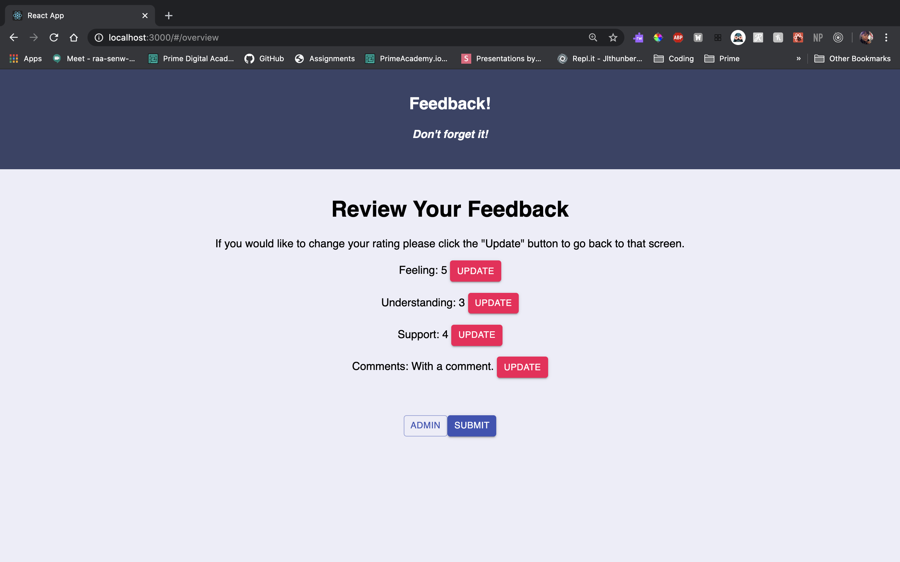

# Redux Feedback Loop

## Description
This is a redux feedback loop that takes in information on each component page via a question. The question data will then be stored and submitted on the last page via an axios call. 

Technologies used: React, Redux, Material-UI, Axios, PostgreSQL, Node.js, Express.js, Javascript, HTML, and CSS. 

